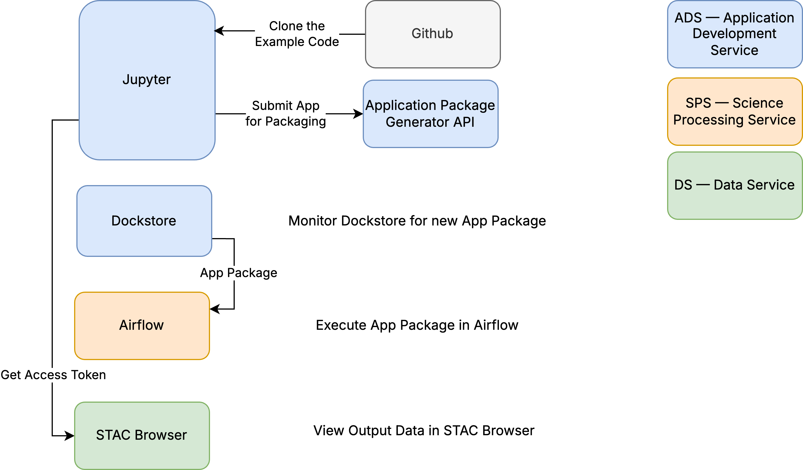

# Learn to Run an Application Package

### Overview

The objective of this Tutorial is to demonstrate the step-by-step instructions for building and running a sample application called “unity-tutorial-application”.&#x20;

You will be cloning an example application in your Jupyter workspace; if you have a place for code (e.g. \~/github or \~/applications) you will want to work there.

Please follow the instructions specified in the following sections in order:

1. [Set up your access](./#id-1.-set-up-your-access): This step is for creating User account(s) to gain access to the MDPS system.
2. [Log into JupyterHub](log-in-to-jupyter-hub.md): This step describes how to access JupyterHub  .
3. [Clone the Example Application Code](clone-the-example-application-code.md): This step describes how to get a local copy of the sample application, “unity-tutorial-application”.
4. [Submit the example application for building](submit-the-app-package-to-the-application-package-generator.md) in the Unity application packaging service: This step describes how to “package” the sample application prior to execution.
5. [Monitor Docker, Dockstore for Application Packages](monitor-the-app-package-generation-process.md): This step describes how to monitor the application packages generated from the previous step.
6. [Execute the App Package in SPS using Airflow](execute-the-app-package-using-airflow.md): This step describes how to execute the application package using Airflow.
7. [View Output Products in STAC Browser](view-output-products-in-stac-browser.md): This step describes how to access the science data products generated by the application package.

<figure><figcaption></figcaption></figure>

### 1. Set Up Your Access

1. Set up a Unity account as per the [Unity Account and Login](../../unity-account-and-login.md) page.
2. For the View Output Products in STAC Browser section, you will need to retrieve an authorization token. Use the [Getting a Unity Token](getting-a-unity-token.md) instructions to do so. A token is also generated in the Submit the App Package to the Application Package Generator section, but it's immediately used in the same notebook and does not need to be copy-pasted as in the STAC Browser section.

### Useful Links

#### References

* Dockstore user guide: [https://docs.dockstore.org/en/stable/getting-started/getting-started.html](https://docs.dockstore.org/en/stable/getting-started/getting-started.html)
* Learning Jupyter: [https://jupyterlab.readthedocs.io/en/stable/getting\_started/overview.html](https://jupyterlab.readthedocs.io/en/stable/getting\_started/overview.html)

