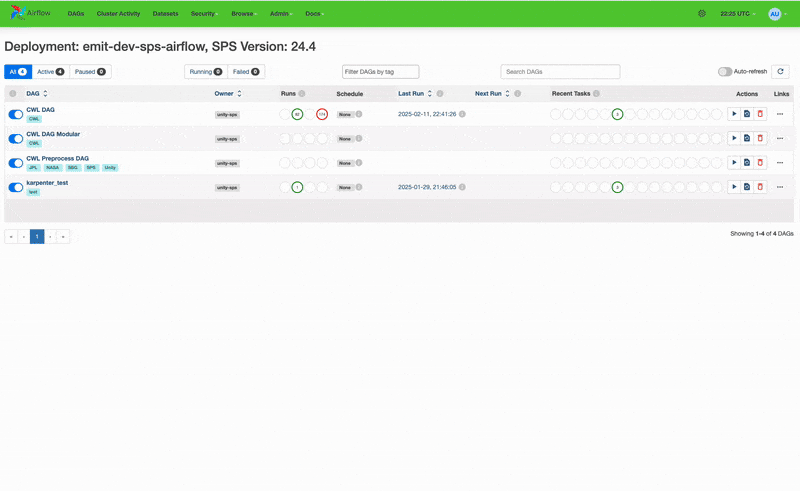

# Re-executing failed jobs in airflow

From time to time, jobs may fail for a number of reasons. By monitoring the logs, often time we can identify the cause of an error in the application package or data. There are times, however, when errors are transient and a simple retry can fix the issue. By default, the airflow deployments retry failed tasks.


The default setup in airflow is to retry tasks two times before failing.


### Restarting a single job

To restart a single job, simply "clear" the task from the dag run details on the dashboard:

<figure><figcaption></figcaption></figure>

### Restarting many jobs

To restart many jobs, for example, all failures or seleccted jobs, you can do this in bulk:

<figure><figcaption></figcaption></figure>

