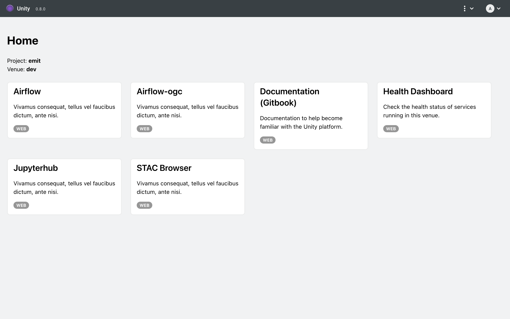
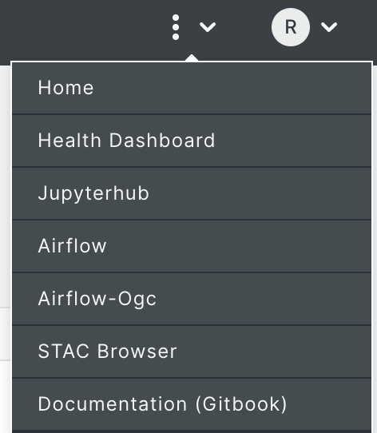
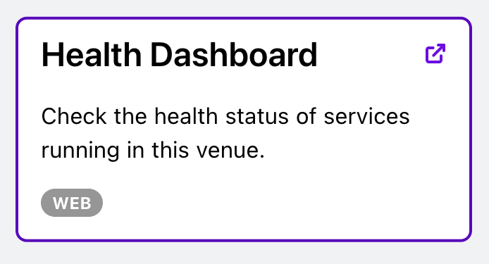

# Using the MDPS Portal

The Portal was created to navigate to the various tools available within a particular MDPS installation. In addition, the Portal provides a health dashboard to assess the health status of the system.

After [navigating to your Portal and successfully logging into your account](../unity-account-and-login.md), you will arrive at the Portal homepage.&#x20;

<figure><figcaption>
MDPS Portal Homepage showing the installed tools
</figcaption></figure>

The portal's navigation bar, visible at the top of the page, provides a menu to easily navigate to the applications available in your installation.&#x20;

The homepage also shows a list of cards indicate the applications installed in your MDPS instance. These application cards are another quick way to navigate to applications by clicking on the card.  Simply hover your cursor over a card and click the icon in the top right corner of the card, as shown in the screenshot below to open the application in a new window.

<figure><figcaption>
Application Card showcasing the visual changes when a cursor hovers over the card, enabling the open in external window feature that is triggered by clicking the icon in the top right corner.
</figcaption></figure>

If at any time you experience issues navigating to or using one of the installed applications or services, navigate to the health dashboard to asses the health status of the application or service. If the application or service is reported as being "UNHEALTHY", please contact the support team.&#x20;

<figure><figcaption>
The Health Dashboard showing the status of all installed web applications and APIs
</figcaption></figure>

